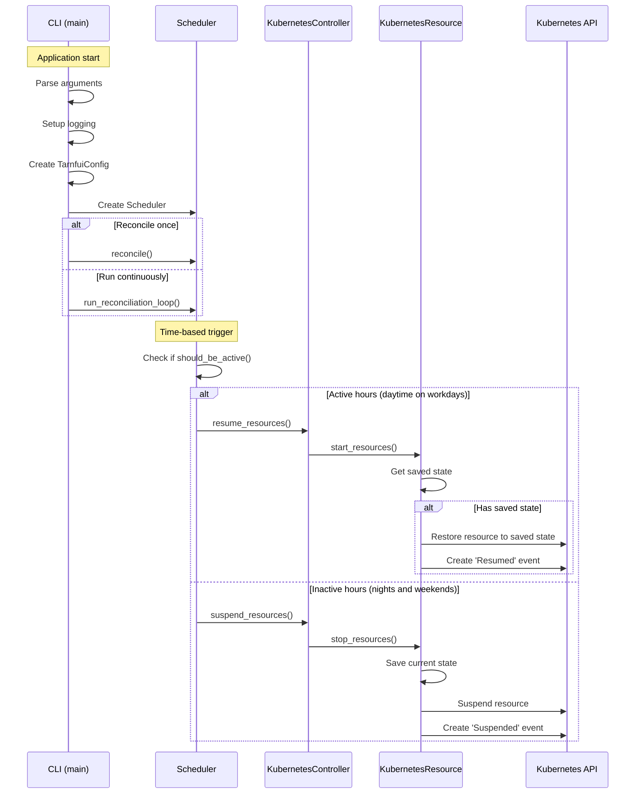
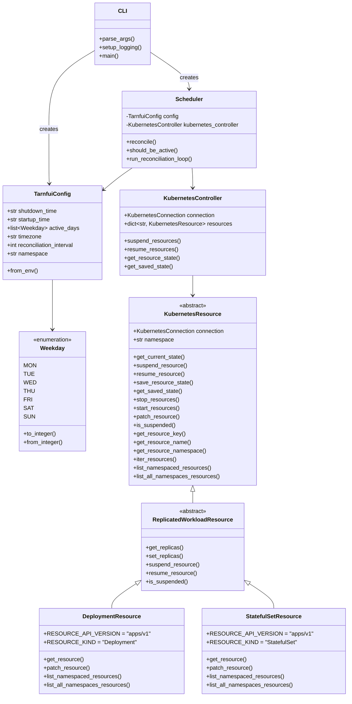

# 🚪Tarnfui 🌠

Kubernetes cost and carbon energy saver that selectively shutdown workloads during non-working hours on staging clusters

The project name Tarnfui comes from [tarn fui](https://www.elfdict.com/wt/520573), an entity created by Tolkien that is described as "The Door of the Night".

## Installation

```bash
uv sync
```

## Utilisation

```bash
python -m tarnfui
```

## Tests

```bash
pytest
```

## Architecture

### Sequence Diagram

The following diagram illustrates the operational workflow of Tarnfui:



### Class Diagram

This diagram shows the core classes and their relationships in Tarnfui:



## Using the Helm Chart

The Helm chart for Tarnfui is published to the GitHub Pages of this repository. To use the chart, follow these steps:

1. Add the Helm repository:

   ```bash
   helm repo add tarnfui https://<your-github-username>.github.io/Tarnfui
   helm repo update
   ```

2. Install the chart:

   ```bash
   helm install tarnfui tarnfui/tarnfui --namespace <your-namespace>
   ```

3. Customize the installation by providing your own `values.yaml` file:

   ```bash
   helm install tarnfui tarnfui/tarnfui --namespace <your-namespace> -f values.yaml
   ```

## Releasing the Project

To release a new version of Tarnfui:

1. Ensure all changes are committed and pushed to the `main` branch.
2. Create a new Git tag following semantic versioning (e.g., `v1.2.3`):

   ```bash
   git tag v1.2.3
   git push origin v1.2.3
   ```

3. The GitHub Actions workflow will automatically:
   - Build and publish a Docker image to GitHub Container Registry (GHCR).
   - Package and publish the Helm chart to the GitHub Pages of this repository.

4. Verify the release by checking the Docker image and Helm chart availability.
